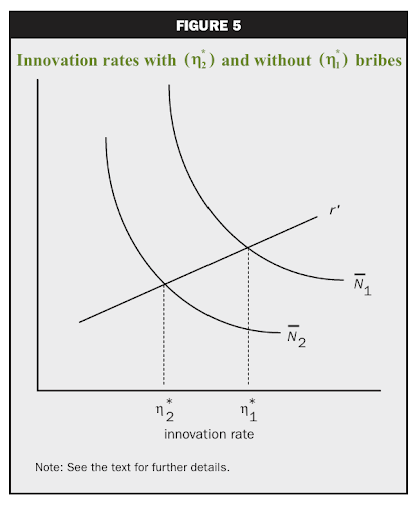
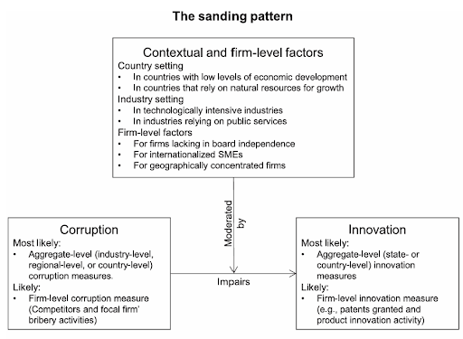

---
format:
  pdf:
    documentclass: report
    classoption: oneside
    pdf-engine: pdflatex
lang: fr
fontsize: 12pt
papersize: a4
geometry: top=1.5cm, bottom=1.5cm, left=2.5cm, right=2.5cm
link-citations: true
nocite: "@*"
header-includes:
  - \usepackage{mathptmx}  
  - \usepackage[colorlinks=true, linkcolor=black, urlcolor=black, citecolor=black]{hyperref}
---

```{=latex}
\begin{titlepage}
\centering

% Logo
\includegraphics[width=0.3\textwidth]{ensai_logo_1.png}\\[1cm]

{\Large \textsc{Rapport du projet d'économie}}\\[0.5cm]
{\normalsize Elèves 1A}\\[2cm]

\rule{\textwidth}{0.5pt}\\[0.7cm]

{\LARGE \textbf{Corruption et Innovation - Sujet 50}}\\[0.7cm]

\rule{\textwidth}{0.5pt}\\[2cm]

\begin{minipage}{0.45\textwidth}
\raggedright
\textit{Étudiants :}\\
Combes Florent id2915\\
Dumas Elouan id2888\\
Perron Ewen id2999
\end{minipage}
\hfill
\begin{minipage}{0.45\textwidth}
\raggedleft
\textit{Responsable :}\\
Alpha Ly \\[0.5cm]

\textit{Encadrant(e) :}\\
Harouna Sedgo
\end{minipage}

\vfill

{\small École nationale de la statistique et de l’analyse de l’information}\\
{\small 2025–2026}

\end{titlepage}

\clearpage
\tableofcontents
\clearpage
```

# Introduction 

“ Le développement économique ne se fait pas par accumulation de capital mais par l’innovation “ selon Schumpeter (1954). Pourtant, durant la période de décolonisation, de nombreuses anciennes colonies ont eu accès à de nouvelles innovations sans que cela ne se traduise par une hausse significative du taux de croissance par habitant. Pourquoi, dans ces cas-là, l’innovation n’a-t-elle pas provoqué une augmentation de la croissance économique ? Selon Acemoglu, Johnson et Robinson, cela serait dû à la corruption provoquée par la faiblesse des institutions. Les bouleversements politiques ont fragilisé les structures étatiques, entraînant un manque de régulation et, en retour, un développement accru de la corruption. La corruption apparaît alors comme un facteur susceptible d’altérer l’impact de l’innovation sur la croissance économique. Ainsi, il serait intéressant de vérifier si la corruption est bel et bien un frein à l’innovation en se demandant : Comment se répercutent les effets pervers de la corruption sur l’innovation ? Dans quel cas la corruption peut à l’inverse être vecteur d’innovation, contrairement à ce que l’on pressent a priori ? En effet, l’innovation constitue un des facteurs clés de la croissance économique et donc du développement. Cependant, si la corruption vient freiner l’innovation, il devient alors essentiel de la limiter, dans la mesure où cela porterait préjudice à la croissance. De plus, pour que le pouvoir étatique puisse avoir un vrai contrôle sur la corruption, il est important de comprendre les mécanismes qui entrent en jeu. Shleifer et Vishny (1993) définissent la corruption comme : “Le fait, pour des fonctionnaires, de tirer profit de la pauvreté de la population à des fins personnelles”. Plus concrètement, la corruption se traduit généralement par un accord privilégié entre un exécutif et un particulier afin d’offrir un avantage à ce dernier en échange d’un pot de vin généralement. Elle permet dans ce cas aux agents corrupteurs de continuer leur activité économique, que ce soit par la distribution de permis, de licences ou de visas notamment. Chose que les agents privés n’auraient pas pû faire sans user de la corruption, en raison du cadre légal dans lequel ils s’inscrivent qui limite l’activité économique privée. Ainsi, on peut distinguer deux types de corruption: la « petite» corruption, qui a lieu à une échelle microéconomique, comme au sein d’une entreprise. C’est par exemple le cas d’un accord entre un commerçant de rue et un maire. À l’opposé, il existe la « grande » corruption, qui a lieu à une échelle macroéconomique, comme au niveau d’un pays, et qui implique de nombreux acteurs importants ainsi que des enjeux plus larges. Cela peut être le cas des lobbys qui exercent une pression sur les pouvoirs législatifs afin de façonner le paysage politique à leur avantage. L’innovation, elle, se définit comme l’ensemble des découvertes permettant l’accélération ou une plus grande efficacité des processus de production. Elle est responsable de l’ouverture de nouvelles possibilités de production ainsi que, généralement, de la réduction de ses coûts. L’innovation se décline en deux formes : une innovation privée, pouvant être réalisée par les entreprises elles-mêmes, et une innovation publique, qui découle directement de la politique de R&D d’un gouvernement ou encore de la mise en place d’un système de protection de la propriété intellectuelle, ce qui passe notamment par l’instauration de brevets ou de licences. Par ailleurs, celle-ci a été largement mise en lumière par J. A. Schumpeter (1942), puis complétée par P. Aghion et P. Howitt (1992), notamment à travers le processus de « destruction créatrice », visant à remplacer les innovations précédentes devenues obsolètes par de nouvelles et ouvrant de nouveaux débouchés pour l’économie. L’innovation a également un effet endogène sur la croissance économique (P. Romer, 1986), qui s’auto-entretient si les investisseurs (publics ou privés) ne sont pas contraints dans le choix de leurs projets. Or, dans le cas où la corruption est introduite, ce phénomène est susceptible d’être mis en déroute. La corruption et l’innovation ont été le sujet de nombreux articles d’étude. Ceux-ci ont relevé que ces deux notions semblent aussi avoir une influence mutuelle l’une sur l’autre. C’est pourquoi on voit émerger un nombre croissant de travaux sur leur relation, notamment ces dernières années. Shoeb Mohammad (2022) nous donne une vision plus globale du cadre dans lequel s’inscrit la littérature scientifique sur le sujet. Sur les 103 articles étudiés par Shoeb Mohammad (2022), 74 % ont été publiés après 2017. 89 % sont des études empiriques contre 11 % d’études conceptuelles. Une majorité d’études se concentre sur un seul pays plutôt que sur une perspective globale. Dans la littérature, deux hypothèses principales s’opposent : l’hypothèse « grease the wheel » (Ngoc Anh Nguyen, Quang Hung Doan, Binh Tran-Nam, 2016), qui considère que la corruption favoriserait l’innovation en supprimant certaines barrières administratives, et l’hypothèse « sand the wheel » (Mohammad , Jie Yang , Irfan Butt, 2022), selon laquelle la corruption réduit l’innovation. Nous assumerons dans notre étude que la corruption a un effet néfaste sur l’innovation (« sand the wheel »). C’est cette deuxième hypothèse qui semble la plus étudiée. Cependant, cet impact peut varier en fonction des circonstances dans lesquelles on s’inscrit. Nous cherchons dans ce papier à comprendre les mécanismes reliant innovation et corruption. Nous montrons notamment que la corruption freine l’innovation par trois biais : la compétitivité, l’incertitude et le coût. Cependant, ces biais peuvent être nuancés par certains facteurs, à savoir : la taille des organisations, le secteur d’activité ou encore le niveau de dépendance d’un pays aux ressources naturelles. Pour répondre à notre question de recherche, nous utiliserons la méthodologie de la revue de littérature. Il s’agira ici d’analyser et de résumer cette dernière afin de pouvoir apporter une réponse explicite à notre sujet. La littérature permet de déterminer quatre points essentiels dans la relation entre innovation et corruption. Nous étudions dans la Section 1 le fait que la corruption perturbe la compétitivité en matière d’innovation par rapport à une situation dite de CPP (concurrence pure et parfaite), sans corruption. Puis, nous montrons dans la Section 2, que d’une part, la faible probabilité de mettre au jour des activités corruptrices est un facteur contribuant à remplacer l’innovation par de la corruption et d’autre part, que l’incertitude rend la corruption préférable à l’innovation. La Section 3 expose les raisons faisant augmenter relativement le coût de l’innovation par rapport à celui de la corruption. De plus, nous étudierons en Section 4 la relation inverse en montrant que certains facteurs réduisent l’impact de la corruption sur l’innovation. Finalement, la Section 5 conclut notre étude.

# I - Effet de la corruption sur le lien entre compétitivité et innovation

La compétitivité est un facteur essentiel pour l’innovation car elle est son principal moteur. Cependant, la corruption peut également être une véritable alternative de source d’innovation, ayant donc pour effet de perturber la relation première entre compétitivité et innovation.

## 1.1 Le lien entre compétitivité et innovation en CPP

Tout d’abord, la compétitivité, qu’elle soit prix ou hors prix, est un des principaux facteurs d’innovation dans une économie. En effet, l’un des axes fondamentaux de la théorie économique est que chaque agent va chercher à maximiser son utilité. Ainsi, face à un produit, un agent va choisir celui dont les caractéristiques sont le plus en adéquation avec ses préférences. Les entreprises qui vendent ce type de produit entrent alors en compétition pour proposer celui qui se différencie positivement des autres. De ce fait, l’innovation est un des leviers principaux pour se différencier de ses concurrents. Celle-ci se caractérise tout d’abord par une hausse des gains de productivité donc par une baisse des coûts de production, permettant soit d’augmenter le profit des firmes, de diminuer le prix du bien vendu ou bien d’augmenter les salaires. Dans le cas de la compétitivité prix, l’innovation permet donc de réduire les prix du produit, et dans le cas de la compétitivité hors-prix, d’améliorer la qualité du produit, ou bien d’effectuer des dépenses de marketing pour accroître la visibilité du produit par exemple. L’innovation est également susceptible, dans un cadre plus général, d’introduire de nouveaux produits ou de créer de nouveaux marchés. De nombreux exemple prouvent que l’innovation peut offrir un avantage concurrentiel non négligeable : les méthodes de classement des pages web (PageRank) inventées par Google leur à permis de dominer pendant longtemps le marché des moteurs de recherche. L’apparition de l’iPhone par Apple a détrôné Nokia, BlackBerry, Motorola. Ainsi, nous voyons que l’innovation présente un atout majeur afin de se démarquer de la concurrence et accroître ses parts de marché. Toutefois, l'introduction de la corruption dans l’économie peut fausser ces mécanismes de concurrence pure et parfaite ...

## 1.2 La corruption fausse le jeu de la concurrence en matière d’innovation

L'introduction de la corruption et des pots-de-vin sur le marché représentent un moyen alternatif pour les entreprises de se démarquer de la concurrence et forcer les consommateurs indirectement à choisir leurs produits. En effet, utiliser de telles méthodes permet de profiter des innovations d’autres entreprises sans innover, en volant les brevets. Ainsi, la confiance nécessaire aux entreprises pour innover et investir n’est plus. Seul l’investissement public à un intérêt dans ce cas de figure, car les coûts massifs supportés par les entreprises innovantes (souvent supérieurs aux coûts de la corruption) ne peuvent plus être couverts par la suite si la propriété intellectuelle (brevets) ne peut pas être garantie. Par ailleurs, il est aussi possible d’améliorer la qualité de son produit en falsifiant certaines normes, ou encore de monopoliser l’offre en passant un accord illicite avec les administrations publiques afin d’éviter la confrontation avec la concurrence. La corruption devient alors un nouveau moyen pour s’emparer d’un marché. Le modèle construit par Marcelo Veracierto (2008) nous montre cette dynamique. En effet, si en temps normal l’entreprise ayant un avantage en termes d’innovation est certaine d’être choisie par le représentant du gouvernement, l’introduction de la corruption permet à l’entreprise en retard au niveau de l’innovation d’avoir la possibilité d’être finalement dans une position plus avantageuse pour elle que pour la concurrence. Ainsi avoir un retard en termes d'innovation n’est pas synonyme de manque à gagner ou d’une moins bonne position sur le marché dans ces conditions. Le progrès, qu’il soit matériel ou immatériel, n'est donc plus l’avantage concurrentiel de prédilection. Cela incite les entreprises à moins miser sur l’innovation, au profit de la corruption. Toutefois, la corruption n’est pas sans risque. Il existe toujours la possibilité d’être découvert et sanctionné. Cependant la probabilité qu’une telle chose se produise est directement liée à l’efficacité du pouvoir en place. Ainsi, plusieurs chercheurs dont Fatma Mrad (2018) ont établi un lien de corrélation positive entre l’efficacité des institutions publiques et le taux d’innovation dans un échantillon de 36 pays en développement ou émergents.


```{r}
#| echo: false

tableau1 <- data.frame(
  Variable = c(
    "Lutte contre la corruption",
    "Efficacité du gouvernement",
    "Qualité de la régulation"
  ),
  `Lien de corrélation avec l’innovation` = c(0.52, 0.59, 0.53),
  check.names = FALSE
)
```

```{r}
#| echo: false
knitr::kable(tableau1, align = c("l", "c"))
```

Tableau des régressions entre corruption et innovation – 2018 – [7] – Fatma Mrad, Nourhen Bouaziz


Cela signifie donc qu’en présence d’une faible capacité d’un gouvernement à mettre en place des normes, une certaine inefficacité de celui-ci, ou bien, en particulier si ce dernier est sujet à une inaction vis-à-vis de la corruption, son impact sur l’innovation sera néfaste pour le pays en question.

Nous avons vu dans cette partie que la corruption freine l’innovation en perturbant la compétitivité, qui est essentielle pour l’innovation. En temps normal, l’innovation est le principal moyen de se démarquer et donc d’être plus compétitif. Cependant, l’apparition d’une stratégie de corruption introduit une alternative à l’innovation. Il devient alors moins nécessaire d’investir dans l’innovation, ce qui freine son développement. Nous allons maintenant étudier que la corruption peut également remplacer la stratégie d’innovation dans certaines situations.

# II - La substitution de la corruption à l’innovation est profitable au sein d’un climat incertain

Il faut retenir non seulement que la corruption est une alternative à l’innovation mais que dans une certaine mesure, c’est-à-dire lorsque la confiance entre les investisseurs et l’Etat est rompue, la corruption peut être bien plus avantageuse que l’innovation car la probabilité que des activités corruptrices soient découvertes est trop faible dans un cadre institutionnel fragile. D’autre part, la corruption se substitue à l’innovation comme seule solution cohérente pour ne pas être évincé du marché dans une économie déjà corrompue .

## 2.1 La faible probabilité de mettre au jour des activités corruptrices la rend substituable à l’innovation

En effet, l’une des principales contraintes de l’innovation réside dans son incertitude à couvrir les dépenses engagées pour la découvrir. Même lorsque des investissements importants sont réalisés, rien ne garantit que la recherche aboutisse ou que l’entreprise parviendra à en tirer un avantage compétitif. À l’inverse, la corruption peut offrir un gain plus immédiat et plus prévisible : un pot-de-vin permet souvent d’obtenir un marché, une autorisation ou un traitement préférentiel sans passer par un long processus d’innovation. L’incertitude associée à l’innovation est technologique et économique, tandis que la corruption comporte un risque d’un autre type : celui d’être découvert et sanctionné. Les entreprises arbitrent donc entre deux stratégies : investir dans une innovation coûteuse aux rendements incertains, ou recourir à la corruption, dont le gain est plus certain mais dont la sanction potentielle dépend de la qualité des institutions. Dans les contextes où les contrôles sont faibles et les sanctions peu probables, la corruption apparaît souvent comme une stratégie moins risquée que l’innovation. Ce mécanisme détourne les entreprises des activités innovantes et contribue à freiner la dynamique d’innovation au niveau national. Ainsi, Kevin M.Murphy, Andrei Shleifer et Robert W. Vishny (1993) soulignent justement cette asymétrie : « Les projets innovants sont généralement risqués, ce qui les rend particulièrement vulnérables à la recherche de rente. Si un projet réussi, les rendements peuvent être expropriés, tandis que s’il échoue, l’innovateur en supporte seul le coût. Ce type de recherche de rente ex-post accroît donc le risque associé à l’innovation. », c’est pourquoi dans une économie corrompue, les entreprises se tournent davantage vers une stratégie de corruption.

## 2.2 La corruption devient la seule stratégie viable au détriment de l’innovation pour demeurer sur le marché

Un second élément essentiel réside dans l’avantage stratégique que la corruption procure par rapport à l’innovation. En effet, quelle que soit la quantité de temps, de capital ou de compétences investie dans un processus innovant, une entreprise ne peut pas rivaliser avec un concurrent qui obtient les mêmes résultats — voire meilleurs — en recourant à la corruption. Le pot-de-vin permet d’obtenir un marché, une autorisation ou un traitement préférentiel sans supporter les coûts, les délais et les incertitudes liés à l’innovation. Cet avantage est si important que, dès lors qu’un acteur choisit la corruption, les autres sont contraints de l’imiter pour rester compétitifs. On peut illustrer ce phénomène par la matrice des profits (gains) suivante en supposant que l’on se place sur un marché en situation de duopole (2 firmes seulement) :


```{r}
#| echo: false

tableau2 <- data.frame(
  `Firme 1 \\ Firme 2` = c("Corrompre", "Innover"),
  Corrompre = c("(40; 40)", "(20; 90)"),
  Innover = c("(90; 20)", "(70; 70)"),
  check.names = FALSE
)

knitr::kable(tableau2, align = "c")
```

(en millions d’€)

Ainsi, c’est ce qu’on appelle un équilibre en stratégie dominante (Nash, 1956), peu importe la stratégie de l’entreprise concurrente, il y a toujours intérêt de corrompre même si les profits obtenus dans la situation finale sont inférieurs à ceux de la situation initiale. En effet si la firme 1 choisit de corrompre alors la firme 2 a tout intérêt de corrompre aussi car en innovant il y aurait un manque à gagner (20\<40); à l’inverse si la firme 1 choisit d’innover, la meilleure stratégie de la firme 2 est de corrompre pour s’emparer du marché. Comme le jeu est symétrique, il en va de même pour la firme 1. Par conséquent, dans un environnement où les décisions publiques peuvent être achetées, l’innovation cesse d’être un levier efficace : elle est systématiquement dominée par la stratégie de corruption, plus rapide, moins coûteuse et sujette à des anticipations croisées par les firmes. Les entreprises se retrouvent donc dans une situation où ne pas corrompre revient à être évincé (ou presque) du marché. De ce fait, la corruption ne se contente pas d’être une alternative à l’innovation : elle la supplante. Elle crée un équilibre pervers dans lequel les agents économiques abandonnent progressivement leurs activités innovantes pour adopter des pratiques corruptives, car ce sont elles qui déterminent réellement la compétitivité dans un marché institutionnellement faible. De plus, la corruption n’est pas seulement une simple alternative à l’innovation, mais dans un cadre où la confiance entre l’Etat et les investisseurs n’est plus, elle lui est supérieure sur beaucoup de points. Généralement, l’avantage que procure la corruption est tellement important qu’un innovateur peut difficilement espérer rivaliser. Ainsi, la seule solution viable pour rester compétitif est de prendre part à la corruption au détriment de l’innovation. On en conclut que, d’un point de vue compétitif, la corruption est généralement plus avantageuse que l’innovation si la probabilité d’être sanctionné est suffisamment faible. Les agents choisissent alors la corruption plutôt que l’innovation.

# III - La corruption implique des coûts excédentaires au détriment de l’innovation

La corruption entraîne également des coûts supplémentaires inhérents à l’innovation. D’une part en raison d’une concurrence corrompue qui fausse le calcul des coûts de l’innovation par l’apparition de coûts de réseau, et d’autre part, nous verrons que la corruption garantit des rendements rapides permettant de couvrir ses coûts au détriment de l’innovation.

## 3.1 La corruption introduit des coûts implicites supplémentaires pour l’innovation

En outre, la corruption accorde une proximité non négligeable avec les pouvoirs publics, ce qui confère une position de premier choix sur un marché pour les entreprises corruptrices. Il est donc loisible de préciser que nous nous éloignons encore de l’idée de concurrence pure et parfaite du fait de l’existence de barrières à l’entrée sur les marchés corrompus, faussant donc dès le départ le calcul des coûts liés à l’innovation pour une entreprise honnête. Par conséquent, la compétition induite par la corruption constitue elle-même un frein majeur à l’innovation. En effet, comme nous l’avons vu dans la première partie, la corruption crée une forme de concurrence asymétrique, fondée non pas sur la performance ou la qualité des produits, mais sur la proximité politique. Ainsi, pour entretenir cette proximité politique, les entreprises doivent faire face à des coûts de réseau, de capital social. Ces coûts peuvent prendre diverses formes comme des cadeaux destinés aux décideurs politiques, des invitations à des événements, soit, de manière générale, tout ce qui est nécessaire pour s’attirer les faveurs des administrations publiques. Par conséquent, les entreprises disposant de relations privilégiées avec les décideurs publics bénéficient d’un accès facilité aux marchés, aux autorisations, ou aux ressources administratives. Elles disposent donc d’un plus grand nombre d’opportunités pour recourir à la corruption. Toutefois, ces connexions politiques sont généralement détenues par les entreprises déjà établies, souvent anciennes et peu innovantes. À l’inverse, les nouvelles entreprises — celles qui portent le plus souvent les innovations — ne disposent pas de ces réseaux informels. Elles se retrouvent donc désavantagées, non pas en raison d’une moindre efficacité, mais parce qu’elles ne peuvent pas rivaliser sur le terrain de la corruption. Ainsi, la corruption renforce les inégalités de relation avec le pouvoir politique et réduit l’avantage concurrentiel que l’innovation devrait normalement procurer. Dans un tel environnement, les entreprises innovantes peinent à entrer sur le marché, tandis que les entreprises connectées se maintiennent grâce à des pratiques non productives. La corruption ne se contente donc pas de freiner l’innovation : elle inverse les règles du jeu, en faisant de la proximité politique un critère de succès plus déterminant que la capacité à innover.

## 3.2 Les coûts de la corruption sont souvent couverts par des profits rapides au détriment de l'innovation

L’innovation repose sur des investissements importants. Elle nécessite du matériel, des compétences spécialisées et du temps, ce qui implique un engagement financier durable et important. Les résultats ne sont jamais immédiats : la recherche doit être financée sur le long terme avant de produire des innovations significatives. Ce décalage de temporalité pèse fortement sur les décisions des investisseurs dans un environnement où la rentabilité d’un projet ne peut pas être garantie à l’avance. De même, la corruption, elle aussi, a un coût. Outre les dépenses d’entretien du “capital corruptible” de l’entreprise, celui-ci peut prendre deux formes. D’abord, des coûts directs, comme le paiement de pots-de-vin ou le transfert d’une partie des bénéfices à des acteurs publics, en lien avec les contrats informels conclus entre les parties prenantes. Puis, on distingue également un coût potentiel, celui de la sanction si la corruption du décideur politique est découverte. Ce coût n’est pas certain, mais il doit être intégré dans la décision. Son importance dépend toutefois de la probabilité d’être détecté, ce qui renvoie à l’efficacité des institutions. L’introduction de la corruption dans un marché a pour conséquence directe de détourner les investissements de l’innovation. Bien que les deux stratégies soient coûteuses, la nature de leurs coûts diffère profondément. Les coûts de l’innovation sont longs, continus et ne produisent un rendement que si le projet aboutit. À l’inverse, les coûts de la corruption génèrent un résultat immédiat et ne nécessitent pas forcément un engagement durable. Une entreprise peut interrompre la corruption à tout moment, alors qu’un innovateur doit s’engager sur une période prolongée. De plus, avant l’achèvement d’un projet innovant, les ressources disponibles sont souvent limitées, ce qui rend l’innovateur particulièrement vulnérable aux imprévus. La corruption apparaît donc comme une stratégie plus flexible, ce qui conduit à une réallocation des ressources au détriment de l’innovation. Par ailleurs, un autre élément renforce cet avantage : l’asymétrie d’impact entre corruption et innovation. Comme montré précédemment, la corruption procure un avantage stratégique significatif, souvent impossible à compenser par l’innovation seule. Cela modifie directement la structure des coûts. Un innovateur doit non seulement financer son processus d’innovation, mais aussi participer à la corruption pour rester compétitif face à des concurrents qui achètent leur accès au marché. Il supporte donc des coûts plus élevés qu’un acteur qui se repose principalement sur la corruption et n’a besoin que d’un minimum d’innovation. Enfin, l’augmentation des coûts réduit mécaniquement les profits attendus. Cette dynamique est largement étudiée dans la littérature. Par exemple, Marcelo Veracierto (1993) construit un modèle fondé sur le calcul des coûts pour comparer les équilibres d’innovation avec et sans corruption. Son analyse montre clairement que la présence de corruption réduit le taux d’innovation en modifiant l’arbitrage entre coûts et rendements (cf graphique ci-dessous).



Finalement, le dernier point qui rend la compétition déséquilibrée en faveur de la stratégie de corruption est qu’elle est inégale. En effet, la corruption requiert des connexions avec les pouvoirs en place. Il devient alors difficile d’entrer sur le marché en utilisant une stratégie d’innovation. C’est pourquoi, ce sont en général les entreprises déjà bien implantées sur le marché qui peuvent envisager d’innover, en raison de l’existence de fortes barrières à l’entrée que représente la corruption. Aussi, corrompre permet d’obtenir une rémunération de court terme contrairement à l’innovation, stratégie de long terme. Toutefois, nous allons voir que la corruption n’est pas toujours synonyme de moins d’innovation.

# IV – Certains facteurs réduisent l’impact de la corruption sur l’innovation

Comme nous l’avons montré précédemment, la corruption constitue généralement un frein à l’innovation. Cependant, cette relation n’est pas uniforme et peut varier voire s’inverser selon plusieurs caractéristiques qu’elles soient institutionnelles, économiques ou organisationnelles. L’analyse de la littérature permet ainsi d’identifier plusieurs variables qui influencent l’intensité de ce lien.

## 4.1 – Les facteurs influençant la relation entre corruption et innovation

Comme mentionné précédemment, l’un des principaux facteurs influençant la corruption est l’efficacité du gouvernement. Un État disposant d’institutions solides et de mécanismes de contrôle efficaces augmente la probabilité de détection et de sanction des activités corruptrices. Dans ce contexte, la corruption devient plus risquée et moins attractive pour les entreprises. L’avantage stratégique qu’elle procure diminue alors, ce qui incite davantage les entreprises à investir dans l’innovation plutôt que dans des pratiques corruptives. Cependant, l’efficacité institutionnelle n’est pas le seul facteur susceptible d’influencer la relation entre corruption et innovation. Dans leur revue de la littérature, Shoeb Mohammad, Jie Yang et Irfan Butt (2022) identifient plusieurs variables importantes.
 


Le premier facteur concerne la taille des organisations. Plus une entreprise dispose d’une dimension importante, plus sa structure organisationnelle comporte d’intermédiaires et de niveaux hiérarchiques. Cette complexité peut créer davantage d’opportunités de corruption. Par ailleurs, les grandes entreprises disposent généralement de ressources financières plus importantes et participent à des marchés de plus grande ampleur. Par conséquent, lorsque la corruption se développe dans ce type d’organisation, son impact sur l’innovation peut être particulièrement important, car les ressources qui auraient pu être consacrées à la recherche et au développement peuvent être détournées vers des activités de recherche de rente. Le deuxième facteur concerne le niveau de dépendance d’un pays aux ressources naturelles ainsi que son niveau de développement économique. Les économies fortement dépendantes de ressources naturelles sont souvent plus exposées à la corruption. En effet, l’accès et l’exploitation de ces ressources est fréquemment déterminé par des décisions politiques ou administratives, créant ainsi des incitations à influencer ces décisions par des moyens informels. Dans ces contextes, les entreprises peuvent privilégier l’obtention d’avantages liés au contrôle des ressources plutôt que l’investissement dans l’innovation. Cette dynamique peut réduire les incitations à développer de nouvelles technologies ou à améliorer les processus de production. Enfin, la nature du secteur d’activité joue également un rôle important. On peut notamment distinguer les entreprises technologiques des entreprises fortement dépendantes des services publics ou de la régulation administrative. Les entreprises technologiques sont généralement moins exposées à la corruption, car leur compétitivité repose davantage sur leur capacité à innover et leur capital technologique. De plus, l’usage des technologies numériques peut réduire les opportunités de corruption en limitant le nombre d’intermédiaires et en améliorant la traçabilité des transactions et des décisions. En revanche, les entreprises opérant dans des secteurs fortement régulés ou dépendants des administrations publiques peuvent être davantage exposées aux pratiques corruptives. La multiplication des procédures administratives, des autorisations ou des contrôles peut créer davantage d’opportunités d’interaction avec les autorités publiques, et donc augmenter le risque de corruption.

## 4.2 – Dans certains cas rares, la corruption peut même favoriser l’innovation

Comme mentionné en introduction, l’hypothèse du « sand the wheel », selon laquelle la corruption freine l’innovation, n’est pas la seule présente dans la littérature. Il existe également l’hypothèse opposée du « grease the wheel », selon laquelle la corruption peut au contraire favoriser l’innovation. En réalité, ces deux hypothèses ne sont pas nécessairement contradictoires : elles peuvent coexister et leur validité dépend largement du contexte étudié. L’hypothèse grease the wheel, bien que plus rare, apparaît dans certaines situations spécifiques. C’est notamment le cas pour certaines formes de petite corruption. En effet, Ngoc Anh Nguyen, Quang Hung Doan et Binh Tran-Nam (2016) montrent dans leurs recherches que la petite corruption peut avoir un impact favorable sur certaines entreprises au Vietnam. Leur étude porte sur le développement de la corruption chez les vendeurs de rue et montre que celle-ci peut, dans certains cas, favoriser l’innovation. Deux facteurs principaux expliquent cette relation. Premièrement, les commerces de rue ont un impact très limité sur l’économie dans son ensemble. Ces entreprises ne sont généralement pas intégrées dans de grandes structures économiques et n’influencent qu’une zone géographique restreinte. Cet impact limité réduit donc fortement les effets négatifs potentiels de la corruption sur l’innovation. D’autre part, ces marchés sont souvent soumis à un cadre réglementaire formel qui existe sur le papier mais qui s’avère difficile à appliquer en pratique. Les tracasseries administratives, les procédures complexes et l’inefficacité bureaucratique rendent l’accès aux autorisations ou aux licences particulièrement difficiles pour les petits commerçants. Dans ce contexte, cette situation favorise d’abord l’apparition de la corruption. Mais surtout, l’absence de cadre institutionnel efficace réduit les incitations à investir dans l’innovation, et donc son développement. Comme mentionné précédemment, l’innovation nécessite du temps ainsi qu’un minimum de stabilité et de structure. Or, lorsqu’il n’existe aucun cadre fonctionnel, les acteurs économiques rencontrent des difficultés à développer de nouvelles pratiques ou à investir dans des améliorations. Dans ce cas précis, les arrangements informels entre commerçants peuvent alors créer une forme de cadre minimal permettant l’émergence de certaines innovations. Ainsi, bien que la corruption perturbe généralement les structures nécessaires à l’innovation, elle peut ici servir de mécanisme permettant de contourner une administration inefficace et excessivement contraignante. Cette situation illustre précisément l’hypothèse du grease the wheel, montrant que, dans certains contextes particuliers, la corruption peut paradoxalement contribuer à favoriser l’innovation. Ainsi, l’impact de la corruption sur l’innovation dépend largement du contexte institutionnel, des caractéristiques des entreprises et de la structure des marchés. Si la littérature souligne majoritairement les effets négatifs de la corruption, certains contextes spécifiques peuvent atténuer ces effets, voire dans des cas particuliers les inverser.

# Conclusion 

L’innovation est l’un des principaux moteurs de la croissance économique, plus particulièrement celui de la croissance intensive. Cependant, elle repose sur plusieurs conditions pour qu’elle puisse apparaître puis croître. Ainsi, ces conditions peuvent ne pas être remplies par l’introduction de la corruption dans l’économie, contribuant ainsi à freiner l’innovation. Tout d’abord, la corruption affaiblit la compétitivité du marché. En favorisant certaines entreprises proches du pouvoir, elle rompt l’égalité entre les firmes et réduit l’incitation à innover. De plus, la corruption peut devenir une alternative à l’innovation. En effet, plutôt que d’investir dans la recherche, certaines entreprises préfèrent obtenir des avantages par des pots-de-vin, un moyen plus rapide et plus sûr dans le cas où le cadre institutionnel est effectivement fragile. Ensuite, l’innovation comporte une forte incertitude, que ce soit en terme de dépenses ou bien de revenus futurs. Rien ne garantit qu’un projet de recherche aboutira. Dans certains contextes, la corruption peut alors apparaître comme une stratégie plus sûre, notamment lorsque le risque d’être découvert est faible et lorsque les institutions sont peu efficaces. Enfin, la corruption détourne des ressources qui pourraient être consacrées à l’innovation. Les entreprises doivent alors répartir leurs moyens entre investissement productif et maintien de relations avec le pouvoir, ce qui réduit les capacités d’innovation. Néanmoins, la relation entre corruption et innovation dépend de nombreux facteurs, comme l’efficacité du gouvernement, la taille des entreprises ou encore la structure économique d’un pays. Dans certains cas rares, la corruption peut même permettre de contourner une bureaucratie inefficace et faciliter certaines initiatives innovantes. De plus, il est à noter que, du fait du caractère illégal de la corruption, il est souvent difficile d’obtenir des données concrètes et fiables. Les impacts et les résultats des études sont ainsi discutables à la lumière des données utilisées, qui peuvent souvent être remises en question. La recherche de données fiables pour tirer des conclusions sur l’impact de la corruption reste aujourd’hui une problématique d’actualité.

# Bibliographie 

1- Corruption and innovation: a grease or sand relationship? - Mahagaonkar, Prashanth - 2008 - EconStor: Corruption and innovation: a grease or sand relationship?

2 - The impact of petty corruption on firm innovation in Vietnam - Ngoc Anh Nguyen, Quang Hung Doan, Binh Tran-Nam - 2016 - https://link.springer.com/article/10.1007/s10611-016-9610-1

3 - Corruption and innovation - Marcelo Veracierto - 2008 - https://papers.ssrn.com/sol3/papers.cfm?abstract_id=1096569

4 - Why Is Rent-Seeking So Costly to Growth? - KEVIN M. MURPHY, ANDREI SHLEIFER, ROBERT W. VISHNY - 1993 - https://www.jstor.org/stable/2117699?casa_token=Rj40P29hXNsAAAAA%3Au01yqxHnvslGdVVldE4tM_WsWwuOl9r6EFQqCBiacEZeZprf3GXvg-cHqp70d3h--4ohMNhZxf9hFVGIUrch1UtJ-dYCtpWyMzgbDuCmrBqS07FIz1M&seq=1

5 - Does corruption have a sanding or greasing impact on innovation? Reconciling the contrasting perspectives through a systematic literature review - Shoeb Mohammad , Jie Yang , Irfan Butt - 2022 - https://www.sciencedirect.com/science/article/pii/S0048733324000854?casa_token=mURDwQmcyxcAAAAA:a1h_abosmN7_lFEbs9my7t5IgRdV6Qc5Gmt5jtgIWy0fR_XAys-pPg46dXRjT43gu-e_EgsARg

6 - Does innovation affect the impact of corruption on economic growth ? Internationale vidence - Ioannis Dokas, Minas Panagiotidis, Stephanos Papadamou, Eleftherios Spyromitros - https://www.sciencedirect.com/science/article/pii/S0313592623000097?casa_token=z-glfjUl1hgAAAAA:zDpc2gZtcDu5gxa_61UqGbcNNIW8kHkA5lwPrvIayYqgeRQUUFAgsew9AyzuJx1Ac6O6JRKN3w 

7 - Les effets de la qualité des institutions sur l’innovation – Fatma Mrad, Nourhen Bouaziz – 2018 : https://shs.cairn.info/article/INNO_PR1_0038
